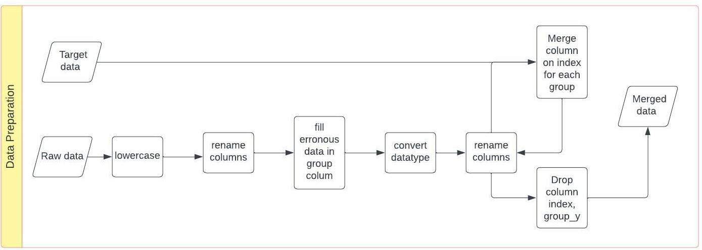

# Coding Challenge

## Data Preparation

### The following steps were taken to prepare the data:

1. Read raw data and target data.
2. Lowercase column names.
3. Rename column names: 'unnamed: 0' to index and 'unnamed: 17' to unnamed_17 
4. Fill missing value of groups with the mode of the groups on date 21/01/2020.
5. Convert datatypes.
6. join raw data and target data on index for each group.
7. Rename and drop columns.

#### The flow chart below shows the steps taken to prepare the data.
