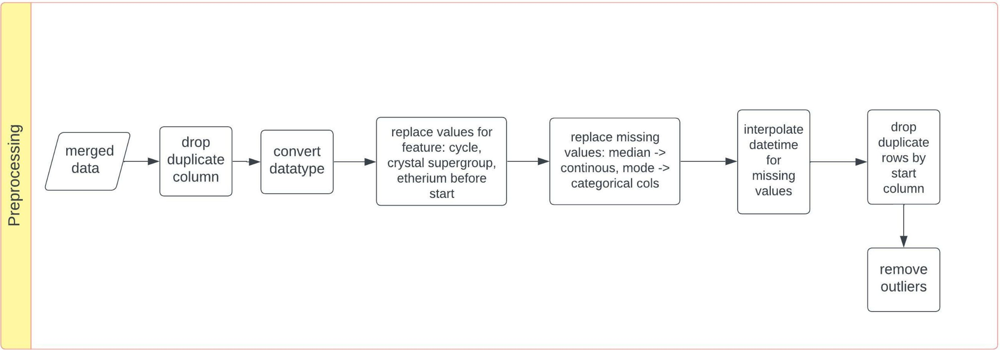
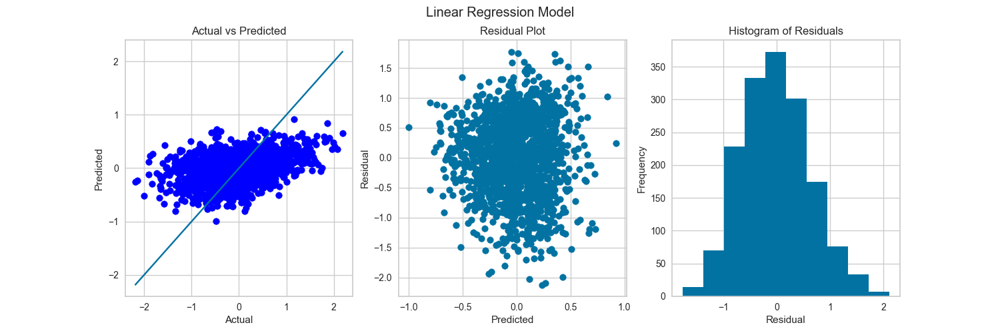
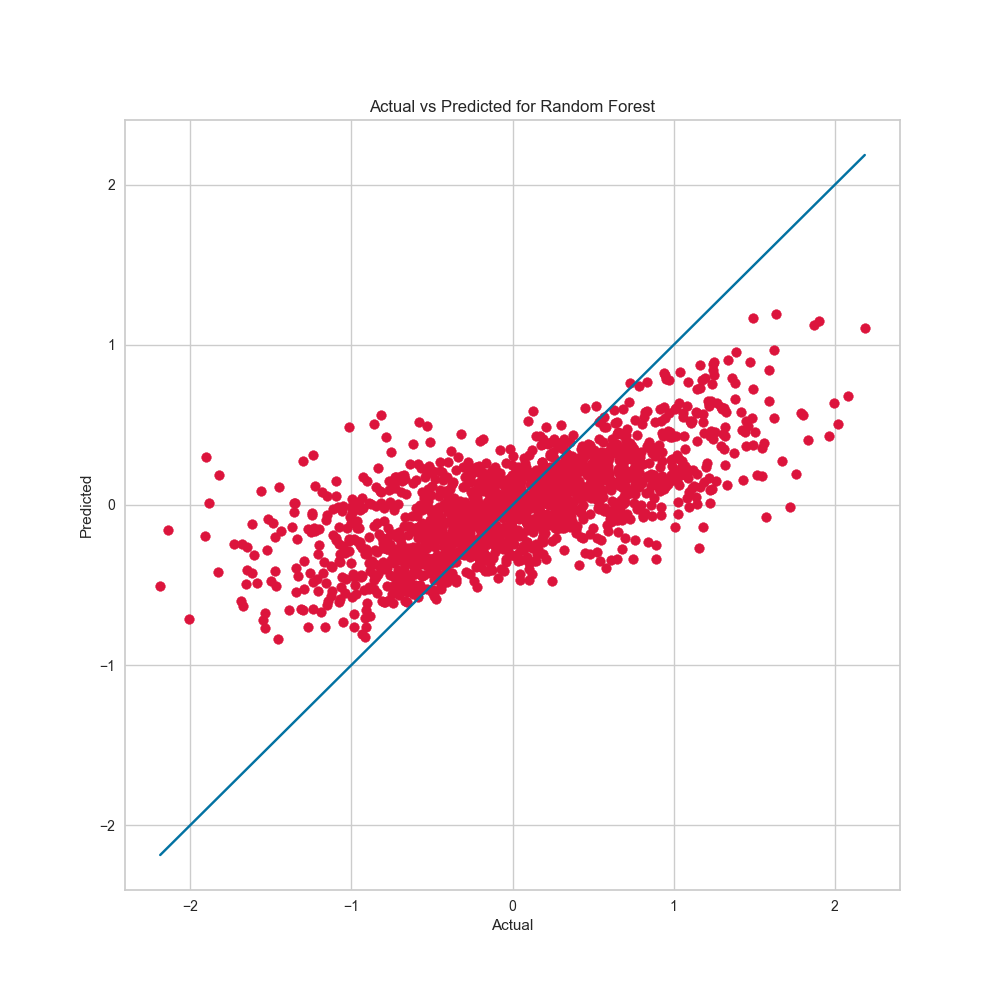
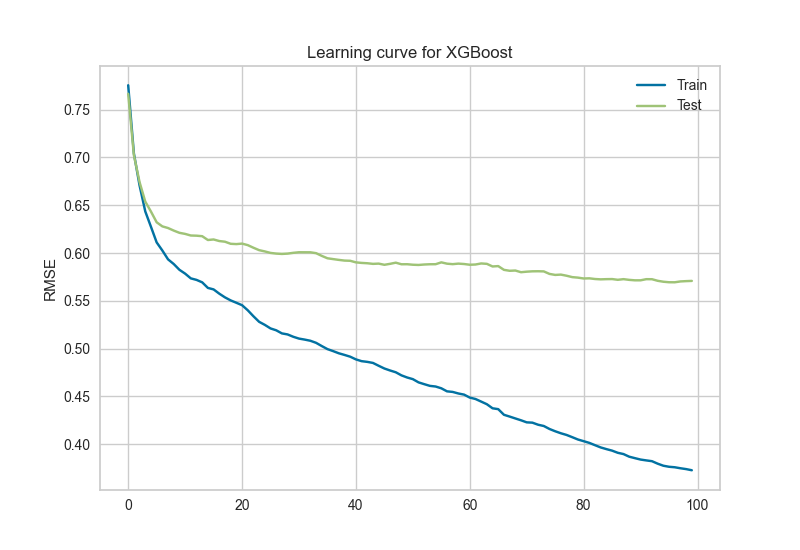

# Coding Challenge

## Summary:

The coding challenge approach: To approach the problem of this coding challenge CRIP-DM methodology was used. The raw data and target data joined on groups and index. The data preprocessing, feature engineering and feature selection were done. The prepared data was trained on 80:20 split (optimum split is 40-80% training data [1]) on based model (multiple linear regression). Hyperparameter tuning was performed on random forest model and a random forest model was trained on best parameters. XGBoost model was also trained on the data. The models were evaluated using Root mean squared error (RMSE), OOB error (for random forest). The random forest model was the best model with the lowest RMSE of 0.51.
The code was transformed into an API and deployed as a docked container instance in Azure.

The API from Azure container instance can be accessed at with a post request:

```
20.126.198.51:8000/predict
```

# Methodology:

To approach the problem of this coding challenge CRIP-DM methodology was used.

The following steps were taken to solve the problem:

## Data understanding

1. The data contains two files two files; raw data and target data containing the indepedent variables and dependent variable respectively.
2. The raw data contains 34 features, 1 id column. The target data file contains dependent feature.
3. There are missing values in the raw data features with 'etherium_before_start' containing the highest number of missing values.
4. There are 14 continous features, 8 categorical features, 9 datetime features.
5. There are duplicate column 'Unnamed: 17' which is a copy of 'first_factor_x' and duplicate rows.
6. There exist multicollinearity between the features. The following features are highle correlated (>0.70) to each other by. The pearson correlation between those features is shown below:
   final_factor_x -> previous_adamantium ->0.777342
   Unnamed: 17 -> previous_factor_x 0.803016
   previous_factor_x -> first_factor_x -> 0.803064
   chemical_x -> previous_adamantium 0.851631.

7. The column cycle contains unknown character: ['2ª', '1ª', '3ª']
8. The target variable is right skewed. The target variable is not normally distributed.
9. Since the target variable is continous, the problem is a regression problem.

## Data Preparation

### The following steps were taken to prepare the data:

1. Read raw data and target data.
2. Lowercase column names.
3. Rename column names: 'unnamed: 0' to index and 'unnamed: 17' to unnamed_17
4. Fill missing value of groups with the mode of the groups on date 21/01/2020.
5. Convert datatypes.
6. join raw data and target data on index for each group.
7. Rename and drop columns.

#### The flow chart below shows the steps taken to prepare the data.


## Data preprocessing

### The following steps were taken to preprocess the data:

1. Drop duplicate column 'Unnamed: 17' which is a copy of 'first_factor_x'.
2. Convert datatypes of the features.
3. Replace values for columns cycle (label encode ['33', '1ª', '2ª', '3ª', '131']), crystal_supergroup (replace '1ª' with 0), etherium_before_start (replace datetime value with the mean of this column)
4. Replace missing values of continuous variables with the median of the variable and missing values of categorical variables with the mode of the variable.
5. Interpolate datetime columns.
6. Drop duplicate rows by 'start' column.
7. Remove outliers with IQR method.

#### The flow chart below shows the steps taken to preprocess the data.



## Feature Engineering

### The following steps were taken to engineer features:

1. Spit the 'when' column in day, weekday, month. Perform one hot encoding on the weekday column.
2. Calculate time difference between timestamps
3. Encoding for categorical columns. To deal with high cardinality and overfitting, we will replace the categories with low frequency with a single category.
4. Target encoding done to deal with high cardinality in the categorical columns.
   Target Encoding (TE) calculates the statistics from a target variable grouped by the unique values of one or more categorical features.
   Calculate mean for the target variable grouped by the unique values of the categorical features. Since target encoding lacks to generalize well and it will tend to overfit. Smoothing is used to generalize the target encoding. The smoothing parameter is calculated using the formula below

```
TE = (count(cat) * mean(target) + smoothing  * global mean(target))
     ____________________________________________________________

                        count(cat) + smoothing
```

5. Count encoding on categorical columns. It is done to calculate frequency from one or more categorical features. The advantage of Count Encoding is that the category values are grouped together based on behavior. Particularly in cases with only a few observation, a decision tree is not able to create a split.
6. Gaussian rank normalization on continous columns and target to normalize the data and reduce the effect of outliers.

#### The flow chart below shows the steps taken to engineer features.


## Feature selection

### The following steps were taken to select features:

#### Continous variable:

1. Removes all the low variance features from the dataset that are of no great use in model training. Drop Columns that are 75% or more similar.
2. Perform Lasso regression with gridsearch CV for different values of alpha to select the best features from step 1.
3. Find correlated features from the best features selected in step 2 and drop the features that are highly correlated with low mutual information score.

#### Categorical variable:

1. Removes all the low variance features from the dataset that are of no great use in model training. Drop Columns that are 75% or more similar.
2. Perform oneway ANOVA test on categorical variables and target to check if there is any statistical differences among the means of two or more groups.
3. Take variables with p value < 0.05. since it rejects the null hypothesis that the means of the groups are equal.

#### The flow chart below shows the steps taken to select features.


## Model building

### The following steps were taken to build the model:

1. Build a baseline model on the selected features. Multiple regression model was used as the baseline model.
2. Perform hyperparameter tuning on random forest model using randomized search CV.
3. Build Random forest model on best parameters from random search cv.
4. Perform hyperparameter tuninng on xgboost model using randomized serach CV. Then train xgboost model on best parameters from random search cv.

#### The flow chart below shows the steps taken to build the model.


## Model evaluation

### The models were evaluted on test data using the following metrics:

1. RMSE, VIF, mean_residuals
2. OOB error, RMSE for random forest model.
3. RMSE for XGBoost model.

#### The flow chart shows the evaluation metric from the model.


#### Evaluation:

Baseline model: RMSE = 0.64 , VIF = 1.05, mean_residuals = 0.02
Random forest model with best parameters: RMSE = 0.54, OOB error = 0.61
XGBoost model: RMSE = 0.52

#### Interpretation:

1. Baseline model: The Value of Root mean squared error is 0.65. and Normalized RMSE = 0.09. The value of VIF is 1.16. This means that there is no multicollinearity in the model. The mean_residuals is 0.01.
2. Random forest model: The value of Root mean squared error is 0.54. and Normalized RMSE = 0.07. The value of OOB error is 0.54. The model will make an error of 54% on test data. The model is overfitting.
3. XGBoost model: The value of Root mean squared error is 0.52.

#### Plots:

1. Actual vs predicted plot for baseline model, Residual plot and histogram of residual for baseline model.
   
   From the above actual vs predicted plot, we can see that there is no linear relation between actual and predicted values. So the linear assumption is violated.

   In residual plot we can see that the residuals are not close to zero. The predictions are not accurate and contains mix of high and low errors. The assumption of Homoscedasticity is violated.

   The histogram shows that residuals is normally distributed.

2. Learning curve for random forest model.
   The gap between training and validation score is large. The plot below shows the error for different training size Due to high variance the model is overfitting. The training error is low while the validataion while the validation error is high.  
   To overcome this, we can do the following: Increase the number of training examples. Use regularization. Reduce the features.
   

3. Actual vs prediction plot for random forest model:
   The plot below shows the scatter plot of actual and predicted values. The prediction are not close to the
   

4. Actual vs prediction distribution plot for random forest model:
   The plot below shows the distribution of actual and predicted values. The distribution of predicted value is not similar to the distribution of actual values.
   

5. Feature Impotance plot for random forest model.
   From the plot we can see that which features are important for the model which is determined by the number of times a feature is used to split the data across all trees. The features with higher number of splits are more important. The features with lower number of splits are less important. The features with zero splits are not important.


6. Actual vs prediction plot for XGBoost model:
   The plot below shows the learning curve of xgboost model. The early stopping parameter was set to 20. It is used to stop training when the validation loss starts to increase. From the plot below we can see that the optimal number of trees are 98 and the rmse for validation set is the lowest at 98 trees.



#### Model interpretation:

1. Random forest:

#### Conclusion:

1. The XGBoost model performs better than the baseline model and random forest model.

#### Further improvements:

1. Use more data to train the model.
2. Try entity embedding for categorical variables
3. Try different feature selection techniques like wrapper method like recursive feature elimination.
4. Try different feature engineering techniques.
5. Try different models. Use Regression-Enhanced Random Forests (RERF) model.

### Folder structure

```
+---api - Contains the code for the API
|
|
+---data - Data folder containing processed data, raw data, interim data
|   +---interim -> Contains the preprocessed data, data from feature engineering and feature selection.
|   |
|   +---processed -> Contains the final data used for model building.
|   |
|   \---raw -> Contains the raw data and merged data
|
+---flowchart -> Contains the flowchart for the project
|
+---logs -> Contains the logs for the project
|
+---models -> Contains the trained models for the project
|
+---reports -> Contains the plots and evaluation metrics for the project
|   +---eval -> Contains evalaution metrics for the models
|   |
|   \---plots -> Contains plots for the models.
|
+---src -> Contains the source code for the project
|   +---data -> Code for data preparation
|   |
|   +---features -> Contains the code for preprocessing, feature engineering, feature selection
|   |
|   +---models -> Contains the code for model building and evaluation
|   |
|   +---utils -> Contains the code for helper functions
|   |
|   \---visualization -> Contains visualization code
|
|   config.yml -> Configuration file for the project containing parameters for the project.
|   imports.py -> Contains the imports for the project.
|   main.py -> Main file for the project.
|   Makefile -> Makefile for the project.
|   README.md -> Readme file for the project.
|   requirements.txt -> Contains the requirements for the project.
|   setup.py -> Setup file for the project.
```

## How to run the code

```
1. Clone the repository
2. py -m pip install --upgrade pip
3. py -m pip install virtualenv
4. py -m virtualenv venv
5. .\venv\Scripts\activate
6. py -m pip install -r requirements.txt
7. py main.py
```

#### Alternatively methods to run the code:

```
1. make run
2. bash run.sh
```

## API

The API is built using fastAPI. The API takes the input as a json file and returns the predicted value as a json file. The model used for the API output is hyperparameter tuned random forest model.

The API can be test by executing the following command:

```
1. cd api
2. uvicorn main:app --reload
3. Open the browser and go to http://127.0.0.1:8000/docs to test the API.
4. Copy the input json file from api/tests/test_data_json/test.json and paste it in the request body.
5. Click on execute button to get the output.
6. The output can be seen in the response body. which is a json file with predicted value 'target' as float.

```

##### Below shows input json to the API.


##### Below shows output of the API.


### Azure container deployment.

1. The API is deployed on azure container instance.
2. The dockerfile is present in the api folder. and used to build the docker image.
3. The docker image is pushed to the Azure container registry.
4. The docker image is deployed on Azure container instance. and the API is tested on the deployed API.

```
Link to the public API: 20.126.198.51:8000/predict
```

### Output of the API from deployed Azure container instance.


### Azure container instance


ref:

1. Dobbin, K.K. and Simon, R.M., 2011. Optimally splitting cases for training and testing high dimensional classifiers. BMC medical genomics, 4(1), pp.1-8.
