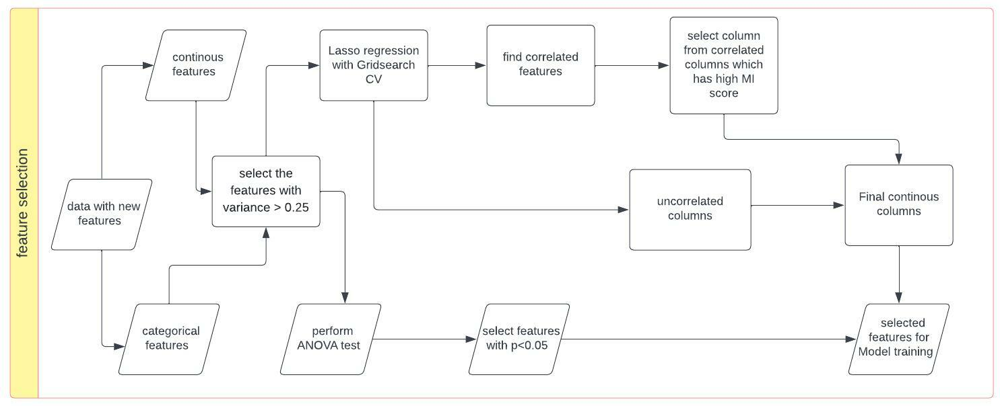
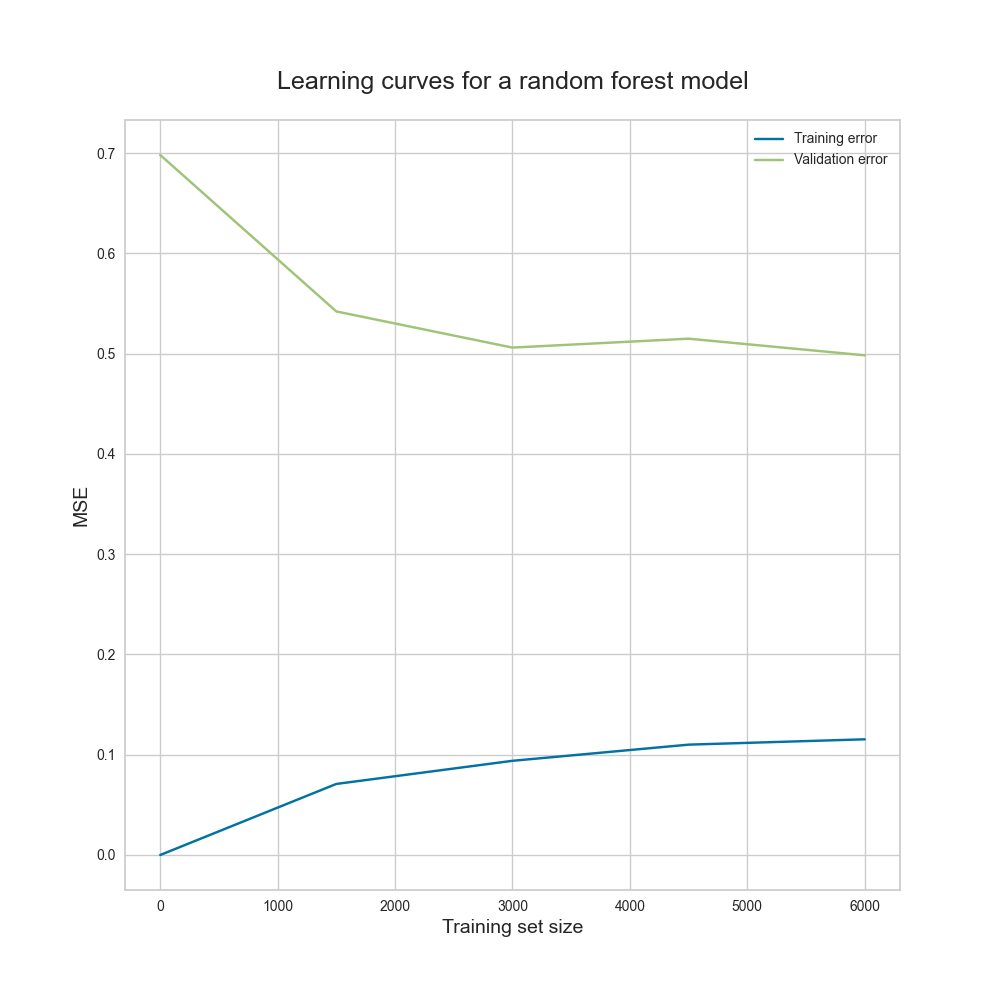
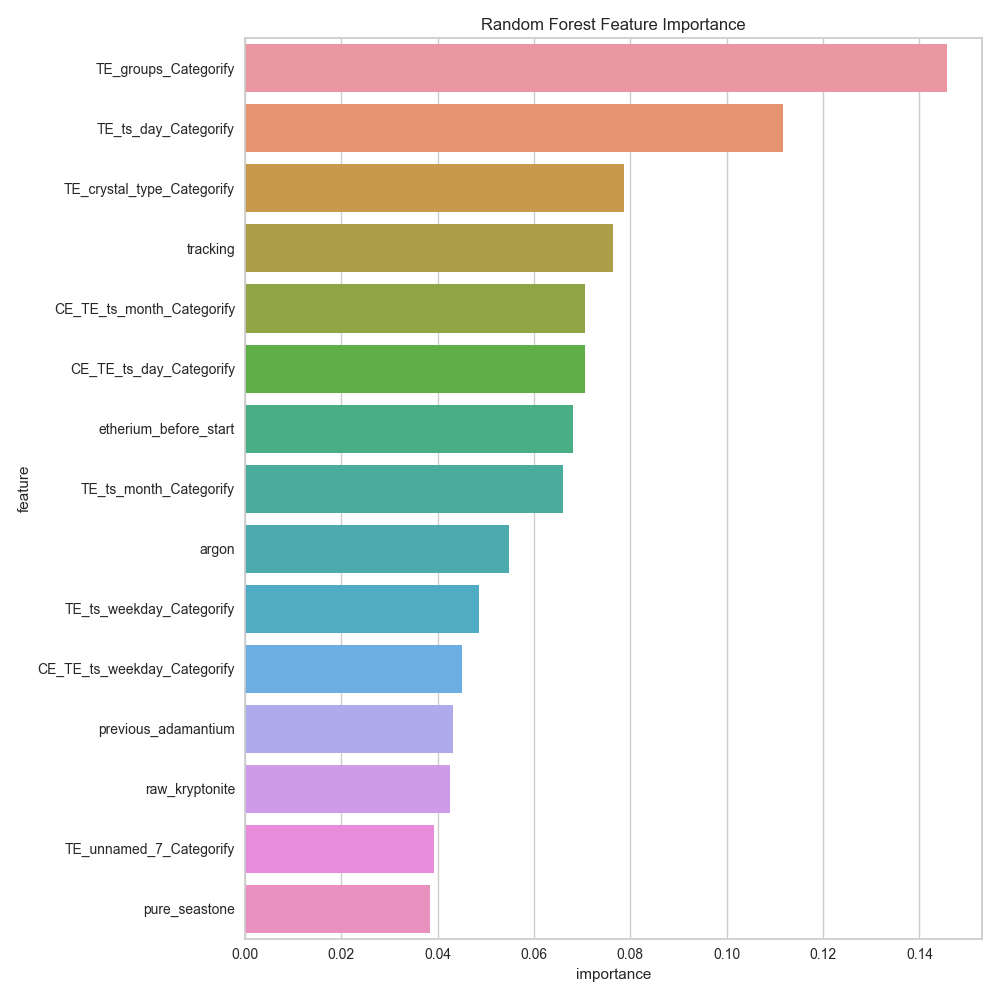

# Coding Challenge

## Data Preparation

### The following steps were taken to prepare the data:

1. Read raw data and target data.
2. Lowercase column names.
3. Rename column names: 'unnamed: 0' to index and 'unnamed: 17' to unnamed_17
4. Fill missing value of groups with the mode of the groups on date 21/01/2020.
5. Convert datatypes.
6. join raw data and target data on index for each group.
7. Rename and drop columns.

#### The flow chart below shows the steps taken to prepare the data.


## Data preprocessing

### The following steps were taken to preprocess the data:

1. Drop duplicate column.
2. convert datatypes.
3. replace values for columns cycle, crystal_supergroup, etherium_before_start.
4. replace missing values of continous variables with the median of the variable and missing values of categorical variables with the mode of the variable.
5. Interpolate datetime columns.
6. Drop duplicate rows by start column.
7. Remove outliers with IQR method.

#### The flow chart below shows the steps taken to preprocess the data.


## Feature Engineering

### The following steps were taken to engineer features:

1. Spit the 'when' column in day, weekday, month. Perform one hot encoding on the weekday column.
2. Calculate time difference between timestamps
3. label encoding for categorical columns. To deal with high cardinality and overfitting, we will replace the categories with low frequency with a single category.
4. Target encoding done to deal with high cardinality in the categorical columns. Calculate mean for the target variable grouped by the unique values of the categorical feauters. Since target encoding lacks to generalize well and it will tend to overfit. Smoothing is used to generalize the target encoding. The smoothing parameter is calculated using the formula below

```
TE = (count(cat) * mean(target) + smoothing  * global mean(target))
     ____________________________________________________________

                        count(cat) + smoothing
```

5. Count encoding on categorical columns. It is done to calculate frequency from one or more categorical features. The advantage of Count Encoding is that the category values are grouped together based on behavior. Particularly in cases with only a few observation, a decision tree is not able to create a split.
6. Gaussian rank normalization on continous columns and target to normalize the data and reduce the effect of outliers.

#### The flow chart below shows the steps taken to engineer features.


## Feature selection

### The following steps were taken to select features:

#### Continous variable:

1. Removes all the low variance features from the dataset that are of no great use in model training. Drop Columns that are 75% or more similar.
2. Perform Lasso regression with gridsearch CV for different values of alpha to select the best features from step 1.
3. Find correlated features from the best features selected in step 2 and drop the features that are highly correlated with low mutual information score.

#### Categorical variable:

1. Removes all the low variance features from the dataset that are of no great use in model training. Drop Columns that are 75% or more similar.
2. Perform oneway ANOVA test on categorical variables and target.
3. Take variables with p value < 0.05.

#### The flow chart below shows the steps taken to select features.



## Model building

### The following steps were taken to build the model:

1. Build a baseline model on the selected features. Multiple regression model was used as the baseline model.
2. Perform hyperparameter tuning on random forest model using random search cv.
3. Build Random forest model on best parameters from random search cv.
4. Build XGBoost model.

#### The flow chart below shows the steps taken to build the model.


## Model evaluation

### The models were evaluted on test data using the following metrics:

1. RMSE, VIF, mean_residuals
2. OOB error, RMSE for random forest model.
3. RMSE for XGBoost model.

#### The flow chart shows the evaluation metric from the model.


#### Results:

Baseline model: RMSE = 0.65 , VIF = 1.17, mean_residuals = 0.01
Random forest model with best parameters: RMSE = 0.51, OOB error = 0.54
XGBoost model: RMSE = 0.61

#### Interpretation:

1. Baseline model: The Value of Root mean squared error is 0.65. and Normalized RMSE = 0.09. The value of VIF is 1.16. This means that there is no multicollinearity in the model. The mean_residuals is 0.01.
2. Random forest model: The value of Root mean squared error is 0.51. and Normalized RMSE = 0.07. The value of OOB error is 0.54. The model will make an error of 54% on test data. The model is overfitting.
3. XGBoost model: The value of Root mean squared error is 0.63.

#### Plots:

1. Actual vs predicted plot for baseline model, Residual plot and histogram of residual for baseline model.
   

From the above actual vs predicted plot, we can see that there is no linear relation between actual and predicted valeues. So the linear assumption is violated.
In residual plot we can see that the residuals are not close to zero. The predictions are not accurate and contains mix of high and low errors.
The histogram shows that residuals are normally distributed.

2. Learning curve for random forest model.
   The gap between training and validation score is large. Due to high variance the model is overfitting. To overcome this, we can do the following: Increase the number of training examples. Use regularization. Reduce the features. Train model on important features.
   

3. Feature Impotance plot for random forest model.
   From the plot we can see that which features are important for the model which is determined by the number of times a feature is used to split the data across all trees. The features with higher number of splits are more important. The features with lower number of splits are less important. The features with zero splits are not important.
   

#### Conclusion:

1. The Random forest model performs comparitively better than the baseline model and XGBoost model. However, futher improvement needs to be done since the model is overfitting.

#### Further improovements:

1. Use more data to train the model. Try different feature selection techniques like wrapper method like recursive feature elimination.
2. Try different models.

### Folder structure

```
+---api - Contains the code for the API
|
|
+---data - Data folder containing processed data, raw data, interim data
|   +---interim -> Contains the preprocessed data, data from feature engineering and feature selection.
|   |
|   +---processed -> Contains the final data used for model building.
|   |
|   \---raw -> Contains the raw data and merged data
|
+---flowchart -> Contains the flowchart for the project
|
+---logs -> Contains the logs for the project
|
+---models -> Contains the trained models for the project
|
+---reports -> Contains the plots and evaluation metrics for the project
|   +---eval -> Contains evalaution metrics for the models
|   |
|   \---plots -> Contains plots for the models.
|
+---src -> Contains the source code for the project
|   +---data -> Code for data preparation
|   |
|   +---features -> Contains the code for preprocessing, feature engineering, feature selection
|   |
|   +---models -> Contains the code for model building and evaluation
|   |
|   +---utils -> Contains the code for helper functions
|   |
|   \---visualization -> Contains visualization code
|
|   config.yml -> Configuration file for the project containing parameters for the project.
|   imports.py -> Contains the imports for the project.
|   main.py -> Main file for the project.
|   Makefile -> Makefile for the project.
|   README.md -> Readme file for the project.
|   requirements.txt -> Contains the requirements for the project.
|   setup.py -> Setup file for the project.
```

## How to run the code

```
1. Clone the repository
2. py -m pip install --upgrade pip
3. py -m pip install virtualenv
4. py -m virtualenv venv
5. .\venv\Scripts\activate
6. py -m pip install -r requirements.txt
7. py main.py
```

#### Alternatively methods to run the code:

```
1. make run
2. bash run.sh
```

## API

The API is built using flask. The API takes the input as a json file and returns the predicted value as a json file. The model used for the API output is hyperparameter tuned random forest model.

The API can be test by executing the following command:

```
python api/app.py
python api/test/predict.py
```

The API takes the input as a json file and returns the predicted value as a json file. A sample test file can
The prediction.json file contains the output of the API.

The API can also be tested using postman. Copy the test_data.json from api/test folder and paste it in the body of the postman. The API will return the predicted value in the response.

##### Below shows the output from postman


